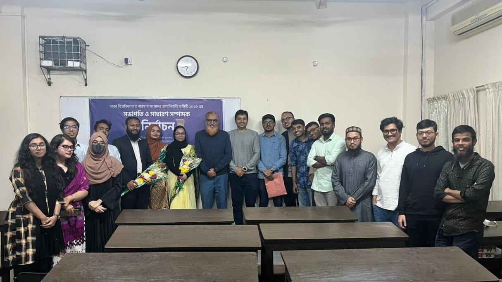

I am deeply honored to share that I have been elected as the **General Secretary** of the **Dhaka University Research Society (DURS)** for the **2026 session**. 

DURS is Bangladesh's pioneering student-led research organization, representing over 3,000 active members. My election follows a unique and rigorous "Merit-Based Selection" process that prioritizes academic excellence and strategic vision over traditional popularity-based voting.

# A Competitive Selection Process
Unlike standard student elections, the leadership transition at DURS involves a comprehensive evaluation of a candidate's research portfolio and organizational blueprints. I had the privilege of presenting my future initiatives before a distinguished **Election Commission** led by:

* [**Professor Dr. Mohammad Manjurul Karim**](https://www.du.ac.bd/faculty/faculty_details/MBI/1650) (Moderator, DURS & Dept. of Microbiology)
* [**Dr. Mumit Al Rashid**](https://www.du.ac.bd/faculty/faculty_details/PERS/1215) (Commission Member)
* [**Md. Johir Rayhan**](https://du.ac.bd/faculty/faculty_details/BIN/68420) (Commission Member)
* **Fahim Hasan Mahdi** (Outgoing President)
* **Shahriar Nazim Simanta** (Outgoing General Secretary)



# Leadership Progression
My journey within the society has been a steady progression of responsibility and commitment:

```{mermaid}
%%| fig-width: 6
%%| fig-align: center
flowchart TD
    A["**General Member**<br><small>2022 — 2023</small>"]
    B["**Coordinator**<br><small>2023 — 2024</small>"]
    C["**Joint Secretary**<br><small>Sep 2024 — 2026</small>"]
    D["**General Secretary**<br><small>Elected 2026</small>"]

    A --> B
    B --> C
    C --> D

    style C fill:#d1e3f8,stroke:#0d6efd
    style D fill:#fff9c4,stroke:#fbc02d,stroke-width:2px,stroke-dasharray: 5 5
```


# My Vision for 2026
As a student of **Applied Statistics & Data Science (ISRT)**, my goal for this session is to integrate statistical rigor into our society's research projects. I look forward to working alongside our newly elected President, **Humayra Anjir**, to:
1.  Strengthen international research collaborations.
2.  Launch data science and methodology workshops for undergraduates.
3.  Foster a culture of evidence-based inquiry across all departments.

---

# In the News
The election has been covered by several national media outlets. You can read the full reports here:

* [**Desh tv:** ঢাবি গবেষণা সংসদের নবনির্বাচিত সভাপতি হুমায়রা, সম্পাদক মনোয়ার](https://www.desh.tv/education/79386)

* [**TBS GRADUATES:** Dhaka University Research Society elects new president and general secretary](https://tbsgraduates.net/campus/dhaka-university-research-society-elects-new-president-and-general-secretary/)

* [**Channel i Online:** ঢাবি গবেষণা সংসদের নবনির্বাচিত সভাপতি হুমায়রা, সম্পাদক মনোয়ার](https://www.channelionline.com/humaira-newly-elected-president-of-du-research-council-editor-monowar/)

* [**Business Times:** ঢাবি গবেষণা সংসদের নতুন সভাপতি হুমায়রা আনজীর, সম্পাদক মনোয়ার হোসেন](https://businesstimes.com.bd/durs-new-committee-2026/)

---

[Back to Home](index.qmd){.btn .btn-outline-primary .btn-sm}