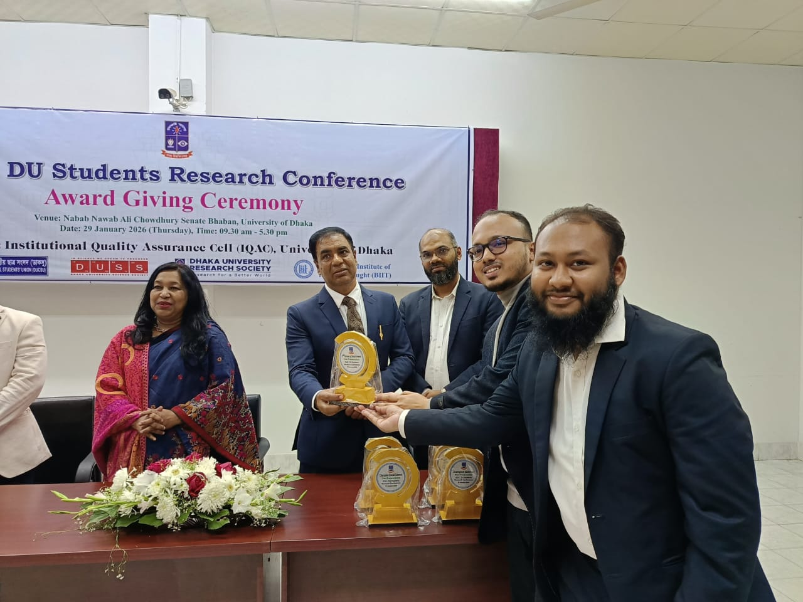
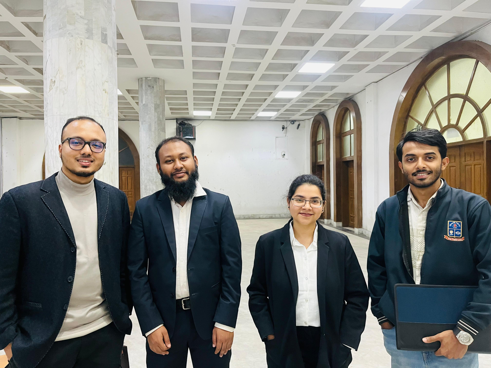

Representing our research team, the President of the **Dhaka University Research Society (DURS)** and I were honored to receive the **2nd Runner-Up Award** at the **IQAC** Student Research Conference. The award was conferred in recognition of our collaborative research on State Reform, which emphasizes the role of student-led inquiry in addressing critical governance and reform-related challenges.

The recognition, awarded by the Institutional Quality Assurance Cell (IQAC), affirms the academic relevance and societal significance of our work. It was a privilege to present our findings at the Senate Bhaban and contribute to ongoing national discourse on state reform and policy expectations.

